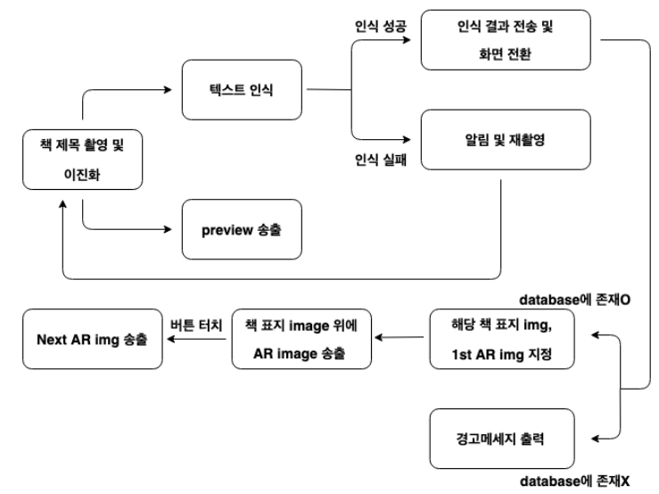
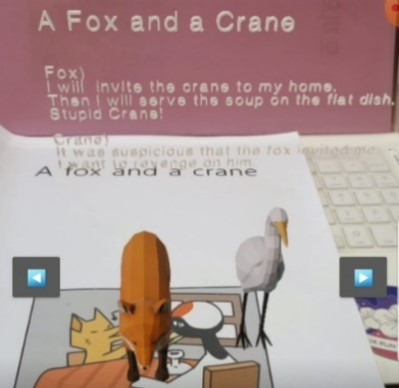

# AR-Book-Intro-for-Kids

본 프로젝트는 핸드폰으로 책을 촬영하면 해당 책의 예고편이나 후킹 메시지를 띄워 주는 기능을 내장하고 있는 어플리케이션 제작을 위한 프로젝트이다. 이러한 아이디어는 추천하고 싶은 도서의 카드뉴스를 제작하는 ‘책 끝을 접다’라는 페이지에서 영감을 얻어, 이를 아동도서에 적용하고 그 자체로 흥미를 유발할 수 있도록 AR(증강현실)을 사용하고자 했다. 어플리케이션은 Android Studio와 ARCore로 설계되었으며, 설계목표는 책 표지를 촬영하여 표지의 텍스트롤 책 제목으로 인식하고 해당하는 AR 영상을 책 표지 이미지위에 송출하는 것이다.

어플리케이션이 정상적으로 작동하기 위해서는 크게 6 단계를 거쳐야한다. 핸드폰의 application 을 실행하여 책 표지를 촬영하면 FirstActivity 코드에서 표지를 이진화하여 책
제목에 해당하는 텍스트 부분만을 추출하고 database 에서 결과와 일치하는 항목을 찾아 책 표지 image 위에 사전에 database 로 입력해놓은 AR 영상을 차례대로 송출한다. 만약 텍스트
인식이 제대로 이루어지지 않거나 database 에 제목과 일치하는 책이 없는 경우 경고메세지를 출력한 후 이전 단계로 돌아가도록 하는 feedback 과정이 이루어진다

자세한 사항은 [보고서](./AR_Book_Intro_for_kids.pdf) 참조

### Set up the enviroment
Android studio 프로젝트를 어플리케이션으로 변환하기 위해서는 프로젝트 [build 및 Release](https://developer.android.com/studio/run?hl=ko)가 필요하다.
Release된 application apk파일은 [여기서](https://drive.google.com/file/d/10Wl7Zqgn_CkN_GZkeBubOKhIzmBS2iKl/view?usp=sharing) 다운받을 수 있다.
Apk 파일을 사용하기 위해서는 휴대폰에 [ARCore sdk](https://github.com/google-ar/arcore-android-sdk/releases)를 먼저 설치해야 합니다. 

### References
We used [ARCore Augmented Images](https://codelabs.developers.google.com/codelabs/augimg-intro/index.html?index=..%2F..index#0) of Google
